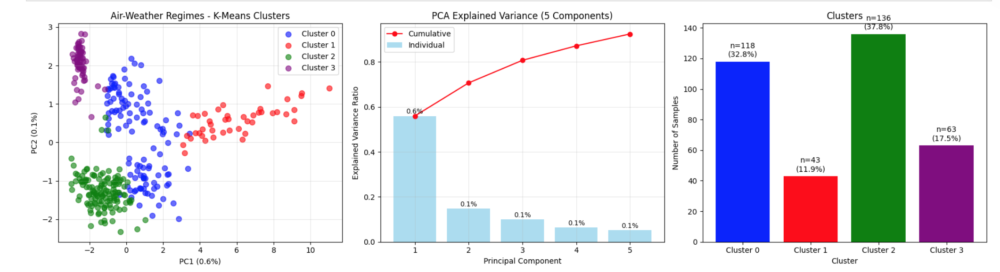
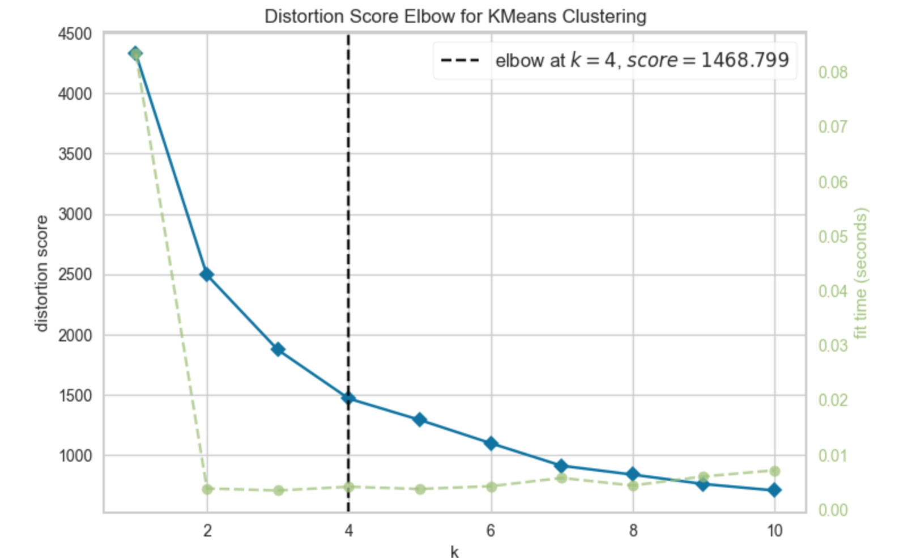
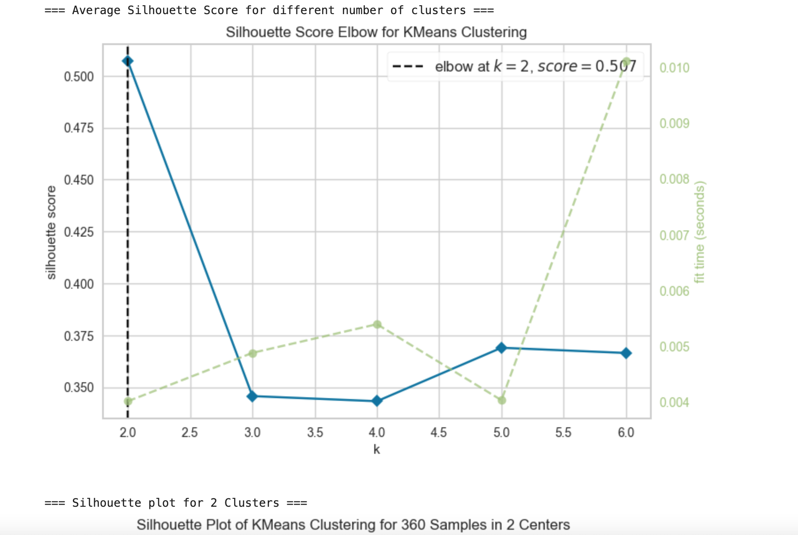
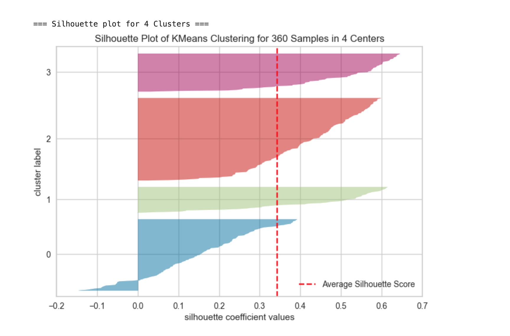
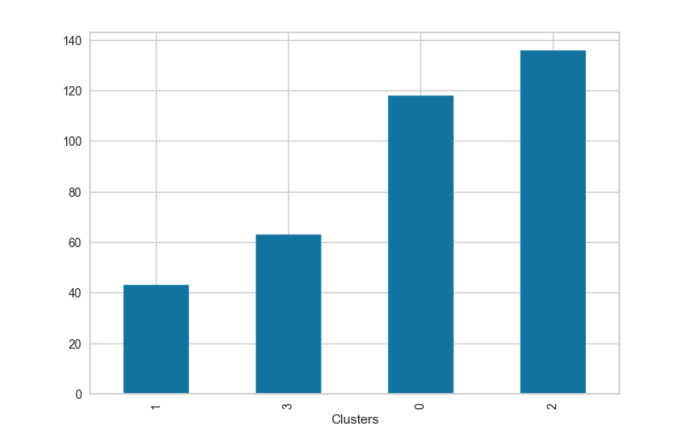
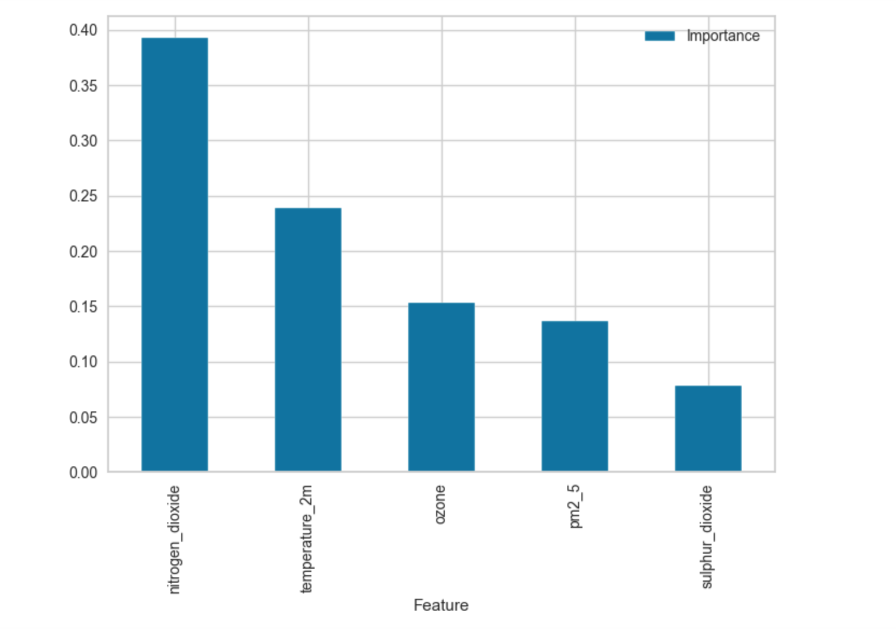
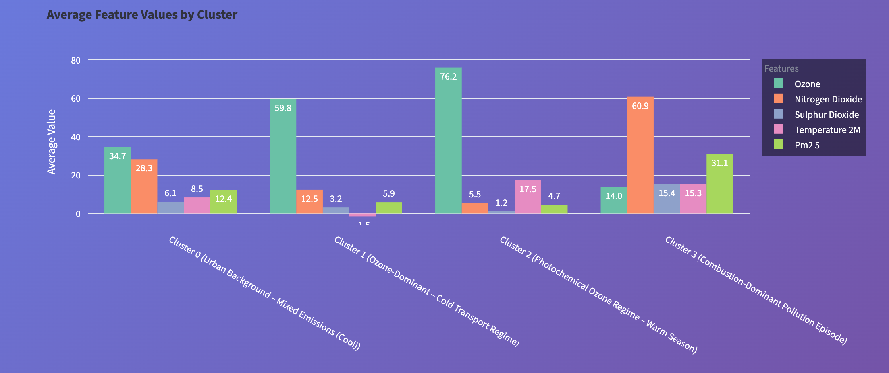
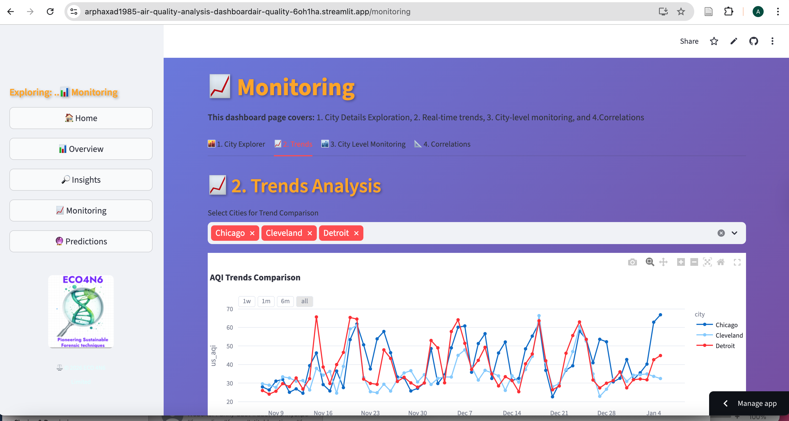

# Air Quality Analysis

This project develops a data-driven air quality intelligence platform that analyses the relationship between meteorological conditions and urban air pollution.

The project integrates exploratory data analysis (EDA), dimensionality reduction, unsupervised clustering, and supervised machine learning to understand and predict air quality risk.

Key objectives include:

• Identifying dominant weather regimes using PCA and K-Means clustering  
• Analysing relationships between meteorological variables and pollutant concentrations  
• Predicting air quality risk levels using an ExtraTrees multiclass classifier  
• Deploying insights through an interactive Streamlit dashboard

The system provides both **environmental analytics** and **predictive air quality monitoring**.

## Dataset Description

This project analyzes integrated air quality and meteorological data across 6 major US cities (Los Angeles, Chicago, Cleveland, Detroit, Houston, Sacramento) over a 60-day winter period (December 2023 - January 2024). The dataset contains 360 total records (6 cities × 60 days) with 15 features including pollution metrics (PM2.5, PM10, AQI, ozone, NO₂, SO₂, CO, CO₂) and weather variables (temperature, humidity, precipitation, wind speed, pressure).

The dataset is well-suited for this analysis with a compact size of approximately 2MB (far below the 100GB repository limit), providing sufficient temporal depth for pattern identification while remaining computationally efficient. The winter timeframe captures cold weather pollution patterns, and the geographic diversity across different US regions enables comparative analysis of urban air quality under varying climatic and industrial conditions. Key features include daily measurements with no missing values, standardized units across all cities, and integration of both pollution and meteorological parameters for comprehensive environmental analysis.

## Business Requirements

This project analyzes air quality across six US cities to support regulatory compliance, public health protection, and urban planning. It enables stakeholders to monitor pollution levels, identify exceedances of WHO and EPA standards, and develop targeted interventions to reduce health risks and avoid regulatory penalties.

Key requirements include integrating air quality and weather data to identify pollution patterns, providing comparative analysis between cities to highlight best practices, and generating actionable insights for evidence-based decision-making. The system must deliver real-time monitoring, automated reporting, and scalable analysis capabilities.

Success will be measured by improved pollution forecasting, identification of high-risk periods for vulnerable populations, and data-driven policy recommendations that lead to measurable air quality improvements across the studied urban centers.

## Hypotheses and How to Validate

1. **Air pollutant concentrations follow a given distribution**  
   The first hypothesis focuses on understanding patterns, variability, and trends in weather and air quality data. Descriptive statistics, including the mean, median, standard deviation, and quartiles, are used to summarise central tendency and dispersion.

2. **Weather's effect can be used in Clustering Weather/Air Regimes**  
   K-Means clustering is employed to group observations based on similarity in meteorological conditions and air quality indicators. Because K-Means requires the number of clusters to be specified in advance, cluster validation techniques are applied. The elbow method is used to examine within-cluster variance across different values of k, while the silhouette score is used to assess cluster cohesion and separation.

3. **Weather-driven patterns can be used to predict Engineered AQI Risk Levels**  
   Supervised multiclass machine learning was applied to test this hypothesis.

## Project Plan

To help plan we used a GitHub project planning board which can be found [here]. The project board gave a structured approach to planning that allowed us to identify the steps and the priority that we should give them.

To ideate hypotheses we used a mixture of EDA, literature review and prompts from Co-pilot.

Data was collected using APIs from Open-Meteo website, processed in Jupyter notebook, analyzed using statistical tests in Python and interpreted using a mix of literature review and generative AI.

## The Rationale to Map the Business Requirements to the Data Visualisations

1. **Interactive Plotly Distribution Plots**  
   The first plot is an interactive Plotly distribution plot of all numeric variables of air quality. The intention was to have a view of the distribution patterns, skewness, etc.

2. **Mean Annual PM2.5 Concentrations by City**  
   This plot compares mean annual PM2.5 concentrations by city against WHO and US EPA air quality standards. This was to provide a comparison of the main pollutant across the cities.

3. **Mean AQI Across Cities**  
   This visualization shows mean AQI across the cities. AQI is an index that is calculated and used as an indicator.

4. **Time Series Plots**  
   The next two visualizations are time series plots demonstrating levels of both AQI and PM2.5 by time across cities.

## Analysis Techniques Used

- **Data cleaning in pandas using a Jupyter Notebook** gave a structured workflow that allows one to follow steps.
- **EDA visualizations in Python** allow data exploration with a wide range of visualization libraries.
- **Generative AI** specifically Co-pilot was used for hypothesis ideation, code debugging, code generation and storytelling.
- **Scikit-Learn** was used for machine learning as it's a relatively easy-to-use library for machine learning tasks.
- **Git** was used for version control.

## Key Features

- Identifies distinct **weather–pollution regimes** using clustering
- Explains relationships between meteorology and air pollution
- Predicts **AQI health risk categories**
- Provides **interactive visualisations**
- Deploys predictions through a **Streamlit dashboard**
- Links pollution regimes to **WHO health risk thresholds**

## Methods Used

- Exploratory Data Analysis (EDA)
- Feature engineering
- Hyperparameter optimisation using GridSearchCV 
- Principal Component Analysis (PCA)
- K-Means clustering for weather regime detection
- ExtraTrees multiclass classifier for AQI risk prediction
- Model evaluation and feature importance analysis
- Interactive dashboard deployment using Streamlit

## Data Science Pipeline

1. **Data Collection**
   - Meteorological and air quality data from multiple cities

2. **Data Preprocessing**
   - Cleaning missing values
   - Feature scaling
   - Missing value handling
   - Variable selection

3. **Exploratory Data Analysis**
   - Correlation analysis
   - Pollution distribution patterns

4. **Dimensionality Reduction**
   - PCA used to identify dominant patterns

5. **Weather Regime Detection**
   - Weather regime identification using K-Means clustering  
   - Cluster validation using silhouette analysis  
   - K-Means clustering to classify pollution-weather regimes

6. **AQI Risk Prediction**
   - ExtraTrees multiclass classifier predicting AQI health risk levels

7. **Deployment**
   - Interactive dashboard built using Streamlit

## Air Quality Index (AQI) Multiclass Classifier
An ExtraTreesClassifier was trained to predict AQI health risk categories based on pollutant and meteorological variables.

### Hyperparameter Tuning
Model performance was optimised using GridSearchCV with 2-fold cross-validation. The tuning process explored combinations of key parameters including: - n_estimators = 20 and to optimise the ExtraTrees classifier.

### AQI Risk Category Mapping
For the multiclass classification task, we transformed the continuous AQI values into four discrete risk categories based on the EPA Air Quality Index breakpoints:

| Category | AQI Range | Description |
|----------|-----------|-------------|
| **Good** | 0-50 | Air quality is satisfactory with little or no health risk |
| **Moderate** | 51-100 | Air quality is acceptable, but some pollutants may pose a moderate health concern for a small number of people |
| **Sensitive** | 101-150 | Members of sensitive groups may experience health effects, but the general public is less likely to be affected |
| **Health Risk** | >150 | Everyone may begin to experience health effects; sensitive groups may experience more serious effects |

These thresholds create a balanced multiclass classification problem where the model learns to predict not just the numerical AQI value, but the corresponding health risk category based on meteorological conditions.
### Model Performance

| Metric | Score |
|------|------|
| Accuracy | 0.92 |
| Precision | 0.90 |
| Recall | 0.90 |
| F1 Score | 0.90 |

The model demonstrates strong predictive performance for AQI risk classification across multiple pollutant and meteorological variables.

## Weather Regime Clustering Model
PCA was used in dimesnsion reduction followed by K-Means clustering to identify dominant weather regimes. 

## Dimension Reduction (PCA)
See below the PCA cluster projection plot:

## Weather Regime Clustering

K-Means clustering was used to identify dominant weather regimes influencing air pollution behaviour. The optimal number of clusters was determined using the elbow method and silhouette analysis.

### Cluster Validation
Multiple cluster sizes were evaluated using elbow method and silhouette analysis to assess cluster separation and cohesion.
### 1. The Elbow method 
The elbow plot shows K = 4



### 2. Silhoutte Validation
- The average silhoutte score was K = 2 for different numbers of clusters.



- Analysis of optimal numer of K from silhoette plots

| k | Observation |
|---|---|
| 2–3 | Insufficient granularity; distinct weather regimes were merged |
| 4 | Majority of observations showed silhouette scores above the dataset average, indicating strong cluster separation |
| 5–7 | Increased granularity but introduced thin or weakly populated clusters and slightly higher negative silhouette values |

**Selected k = 4** as the optimal configuration, balancing interpretability, cluster stability, and environmental regime differentiation.
the silhoutte plot for 4 clusters is shown below.



### Cluster Frequency


### Feature Importance
The plot below shows feature importance and relevant metrics.


### Cluster Profiling
Achieved by calculating the mean values of each meteorological variable within each cluster. This allowed characterizing the distinct air-weather regimes based on their unique combinations of temperature, humidity, precipitation, wind speed, and surface pressure.



- **Cluster 0** Urban background - Mixed Emmissions (cool).
- **Cluster 1** Ozone dominant - Cold Transprt regime.
- **Cluster 2** Photochemical Ozone Regime (warm season).
- **Cluster 3** Combustion - Dominant Pollution Episode

## Ethical Considerations

**Data Attribution:** All meteorological and air quality data must be properly attributed to Open-Meteo under their CC BY 4.0 license, with clear disclosure of model limitations and uncertainties.

**Public Responsibility:** Health advisories based on predictions must avoid alarmist language, include uncertainty estimates, and never replace official emergency warnings or medical advice.

**Algorithmic Fairness:** Geographic biases in data resolution must be acknowledged, ensuring transparency about varying accuracy across regions and avoiding stigmatization of specific communities.

## Dashboard Design
## Dashboard Preview

**Home page: Air Quality Dashboard**  
Has side panel with 4 tabs for all other pages. Main content includes tabs of the other pages.

**Overview Page**  
Main content includes dataset preview, basic statistics, and fundamental visualizations. Side panel has tabs for all pages.

**Insights Page**  
Has city comparisons, detailed analysis, and AQI health guidelines. Side panel has all pages tabs, filter settings for selecting city comparison by the metric.

**Monitoring Page**  
In adition to a side pannel, this pages has the following button links that leads to the relevant views: 1. City explorer, 2. Trends, 3. City level monitoring,  4. Correlations (weather vs air variable by city), Correlation Heatmap.

**Predictions Page**  
Alongside side panel, a Machine Learning Models page that divides further into atmospheric regime analysis and AQI risk forecasting via button links.


## Fixed Bugs

| Bug | Resolution |
|-----|------------|
| **Streamlit page loading errors due to file and model path issues** | Fixed dataset and model loading paths across all pages using `Path(__file__).parent.parent.parent` for consistent file resolution. Resolved "FileNotFoundError" and model loading failures in deployed environment. |
| **Prediction page showing wrong dataframe with only 2 features** | Corrected feature names in training script to match actual dataset columns (`pm2_5`, `pm10`, `ozone`, `nitrogen_dioxide`, `sulphur_dioxide`). Retrained model to v5 with proper feature mapping. |
| **Cluster misclassification** | Implemented distance-based correction using actual cluster centers from training data. Added logic to reassign moderate pollution values from Cluster 3 to appropriate clusters based on temperature and pollutant levels. |
| **Missing "Unhealthy" predictions** | Added EPA-aligned manual override (PM2.5 > 55.5 triggers 🔴 Health Risk) since dataset contains no AQI >150 samples. Model now correctly warns for extreme pollution events. |
| **Model versioning confusion** | Cleaned up models folder to keep only essential files: original notebook models (`final_aqi_classifier.pkl`, `weather_air_regime_cluster.pkl`) and Streamlit-optimized versions (`weather_regime_cluster_v1.pkl`, `aqi_risk_classifier_v5.pkl`). |


## Development Roadmap

1. The LMS material on K-Means clustering had a few errors and it heavily jeopardized my progress. At one point it referred to `df_elbows` instead of `df_analysis`.

2. Instead of training and fitting the data during clustering, the method just trains and gives a label which is subsequently used for supervised training as a label for metrics. Separate prediction on this cluster should have been used to get cluster IDs instead of label to enable smooth pipeline.

## Running the project Locally
### Option 1. Use the Deployed App (Easiest)

The app can be found at: https://arphaxad1985-air-quality-analysis-dashboardair-quality-6oh1ha.streamlit.app/

### Option 2: Run Locally (For Developers)
1. **Clone the repository**
   ```bash
   git clone https://github.com/arphaxadnguka1985/air_quality_analysis.git
   cd air_quality_analysis
2. **Set up virtual environment (optional but recommended)**
### On macOS/Linux:
- python -m venv venv
- source venv/bin/activate
### On Windows:
- python -m venv venv
- venv\Scripts\activate
3. **Install dependencies**
- pip install -r requirements.txt
4. **Launch the dashboard**
- streamlit run dashboard/air_quality.py

## Main Data Analysis Libraries/ Requirements

- streamlit>=1.28.0
- pandas>=2.0.0
- numpy>=1.24.0
- plotly>=5.14.0
- matplotlib>=3.7.0
- scikit-learn>=1.3.0
- joblib>=1.3.0
- statsmodels>=0.14.0
- jupyter nootbook

## AI Tools

- Co-Pilot
- Google Search with AI responses

## Repository Structure
```
air_quality_analysis/
├── dashboard/                          # Streamlit dashboard application
│   ├── air_quality.py                   # Main app entry point
│   ├── pages/                            # Multi-page dashboard sections
│   │   ├── 1_overview.py                 # Dataset preview & basic statistics
│   │   ├── 2_insights.py                 # City comparisons & AQI health guidelines
│   │   ├── 3_monitoring.py                # Trends & correlations
│   │   └── 4_predictions.py               # ML predictions
│   ├── train_cluster_model.py             # Weather regime clustering training script
│   ├── train_aqi_classifier.py            # AQI risk classifier training script
│   ├── requirements.txt                   # Dashboard-specific dependencies
│   └── logo.png                           # ECO 4N6 company logo
│
├── notebooks/                           # Jupyter notebooks for EDA & model development
│   ├── 01_data_collection.ipynb          # API data fetching from Open-Meteo
│   ├── 02_eda_visualization.ipynb        # Exploratory data analysis
│   ├── 03_clustering_analysis.ipynb      # K-Means & PCA for weather regimes
│   └── 04_classification_modeling.ipynb  # ExtraTrees for AQI risk prediction
│
├── datasets/                            # Processed data
│   ├── dashboard_df.csv                  # Final integrated dataset (360 records)
│   ├── weather_df.csv                    # Additional weather data
│   └── air_quality_df.csv                # Additional air quality data
│
├── models/                               # Trained machine learning models
│   ├── weather_air_regime_cluster.pkl     # Original K-Means cluster model
│   ├── final_aqi_classifier.pkl           # Original ExtraTrees classifier
│   ├── weather_regime_cluster_v1.pkl      # Streamlit-optimized cluster model
│   └── aqi_risk_classifier_v5.pkl         # Streamlit-optimized AQI classifier
│
├── figures/                              # Images for documentation
│   ├── dashboard.png                      # Dashboard preview screenshot
│   ├── pca.png                            # PCA visualization with 4 clusters
│   ├── cluster_freq.png                   # Cluster frequency distribution
│   ├── feature_imp.png                     # Feature importance plot
│   ├── cluster_map.png                     # Cluster mapping/interpretation
│   ├── silhouette.png                      # Silhouette analysis plot
│   ├── silhouette_4.png                    # Silhouette plot for k=4
│   ├── elbow.png                           # Elbow method plot
│   └── image.jpg                          # Additional documentation image
│
├── .gitignore                            # Git ignore rules
├── requirements.txt                       # Project-wide dependencies
└── README.md                              # Project documentation
```

## Future Improvements

### Phase 1: Real-Time Implementation
- [ ] Live weather data ingestion from Open-Meteo API
- [ ] Automated daily model updates
- [ ] Real-time AQI risk predictions for current conditions
- [ ] Automated alert system for high-risk days

### Phase 2: Temporal Expansion
- [ ] Extend training data to 10 years for robust pattern detection
- [ ] Add hourly predictions to capture diurnal pollution cycles
- [ ] Analyze seasonal trends and anomalies

### Phase 3: Geographic Coverage
- [ ] Include 20+ cities across different climate zones
- [ ] Compare urban vs. rural air quality patterns
- [ ] Interactive map visualization


## Credits

- **Code Institute**: https://learn.codeinstitute.net/ and GitHub: https://github.com/Code-Institute-Solutions/da-README-template, https://github.com/Code-Institute-Org/data-analytics-template
- **CoPilot** for code correction, generation utilizing various prompts

## Content and Media

- **Dataset**: https://open-meteo.com
- **Instructions and project templates**: Code Institute https://learn.codeinstitute.net/

## Media

- The photos used on the home and sign-up page are from open-source sites
- The images used for PowerPoint presentation were taken from Leonardo.ai, an open-source site

## Acknowledgement

My appreciation to everyone who supported me during this process.